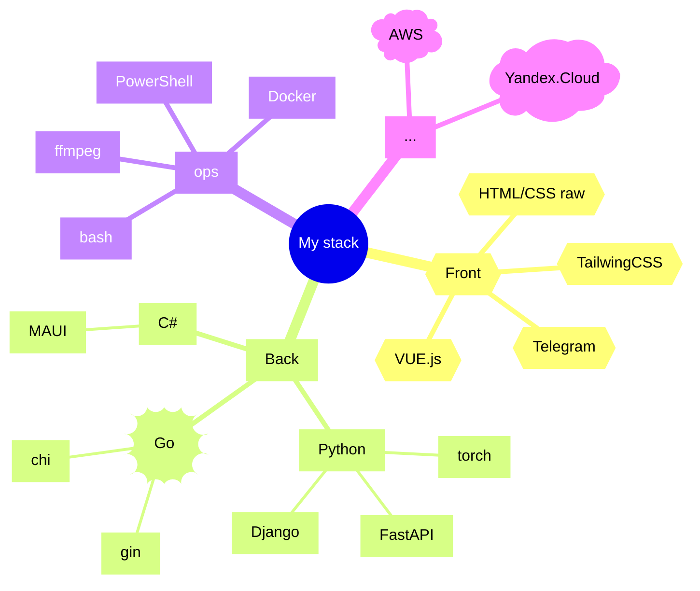

### Go/python fullstack 👋

- 🔭 I’m currently working on [Yandex Cloud](https://cloud.yandex.ru) library
- 🌱 I’m currently learning Go, sometimes html+css
- 👯 I’m looking to collaborate on go project
- 🤔 I’m looking for help with rewiewing [minimal lib](https://github.com/thefrol/minimal)
- 💬 Ask me about jazz
- 📫 How to reach me: mail@frolenkodima.ru
- 😄 Pronouns: he/his
- ⚡ Fun fact: was skipping sports to go to coding lessong, my father would kill me that days
